<h1 align="center">
  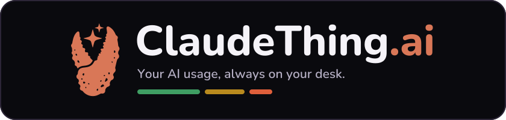
</h1>

<p align="center">
  <a href="https://github.com/petehottelet/ClaudeThing/actions/workflows/ci.yml"></a>
  <a href="LICENSE"></a>
  <a href="package.json"></a>
  
</p>

<p align="center">
  
  
  
  
</p>

<p align="center">
  <a href="INSTALL.md"><strong>Install</strong></a> ·
  <a href="#see-it-in-action"><strong>Screenshots</strong></a> ·
  <a href="#ready-to-use-today"><strong>Features</strong></a> ·
  <a href="#how-it-works"><strong>Architecture</strong></a> ·
  <a href="#safety-and-limits"><strong>Safety</strong></a>
</p>

<p align="center">
  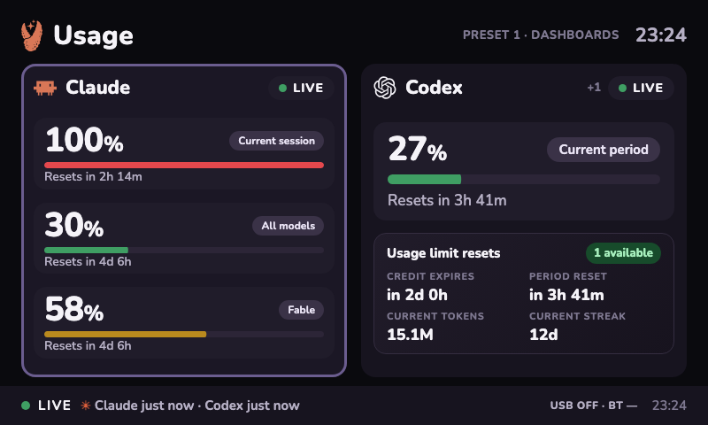
</p>

## Give your Car Thing a useful second life

**ClaudeThing.ai is custom firmware that turns Spotify Car Thing into a friendly, always-on dashboard for Claude and Codex usage, Google Analytics 4, YouTube Analytics, stock-market information, and whatever you want to add next.**

Instead of opening another tab to wonder where your limits or key metrics stand, glance at the display on your desk. The dark 800×480 interface is designed around the hardware you already have: turn the dial to explore, press to open, use the preset buttons to jump, and let rotating market views keep the screen useful on their own.

A collector on the attached computer reads local telemetry and atomically mirrors only bounded numeric summaries into the display's loopback web root. USB/ADB is preferred; on macOS, an authenticated Bluetooth fallback can keep data moving when a dock or hub provides power but does not enumerate the device. Authenticated HTTP/WebSocket transport remains available for stable direct or trusted-LAN connections. Credentials stay on the host and are never built into firmware or copied into the mirrored snapshot.

### Why you might love it

- **Glanceable by design.** Current usage, reset timing, trends, analytics, and markets stay visible without interrupting your work.
- **Local-first and private.** There is no ClaudeThing cloud account or hosted telemetry service; the host collector and display communicate directly.
- **Made for the real controls.** The rotary dial, dial press, Back button, presets, touch, and swipes all have useful jobs.
- **Easy to make yours.** Edit one commented `dashboard-config.jsonc` file to choose providers, data lanes, channel/property labels, stocks, indexes, funds, and rotation timing. Valid changes appear within about five seconds without restarting the service.
- **Built to grow.** Shared chart, transport, status, input, and configuration primitives make new providers and dashboard views additive rather than a reason to start over.
- **A broad provider platform.** Six native collectors cover Claude, Codex, Cursor, Gemini, Droid, and Copilot. A validated local JSON bridge and ready-to-uncomment catalog stubs bring the same quota, cost, balance, status, and history views to dozens more sources.
- **Honest about data.** Live, stale, offline, unavailable, and error states remain distinct; missing telemetry is never dressed up as a zero.

ClaudeThing is a non-profit, community open-source project. It is not affiliated with, endorsed by, sponsored by, or supported by Anthropic, OpenAI, Google, Spotify, or any other AI lab, model provider, platform vendor, or hardware manufacturer.

The persistent development firmware has booted on real hardware and displayed live Claude and Codex data. Display, USB ADB, the host tunnel, dashboard HTTP service, Chromium kiosk, and physical dial input have been exercised. The Bluetooth fallback is compiled into the current development candidate and remains a physical-device acceptance gate until pairing and hub-powered failover pass on hardware. Claude quota updates use the signed-in local CLI credential with automatic OAuth refresh, retained last-good state, rate-limit-aware polling, and status-line observations as a second source. On macOS, this requires a one-time Keychain authorization; denying it disables that lane for the collector run instead of repeating the prompt. Production firmware, unattended recovery, and the full physical-control/soak matrix remain release gates.

## Install with a coding agent

The easiest route is to point your coding agent at [this repository](https://github.com/petehottelet/ClaudeThing) and paste this instruction:

> Install ClaudeThing.ai on my USB-connected Spotify Car Thing. Follow `INSTALL.md` and the repository safety rules, verify the host and device at each stage, preserve a complete factory backup, and stop before flashing until I explicitly approve the exact artifact, byte size, and SHA-256.

The repository gives the agent concrete checks and safety stops for each stage. It can inspect compatibility, install the host collector, build and verify firmware, configure the dashboard, qualify the USB connection, and provision the device after an approved flash. Prefer doing it yourself? The same complete path is in [INSTALL.md](INSTALL.md).

## See it in action

| Dashboard picker | AI usage by day |
| --- | --- |
| 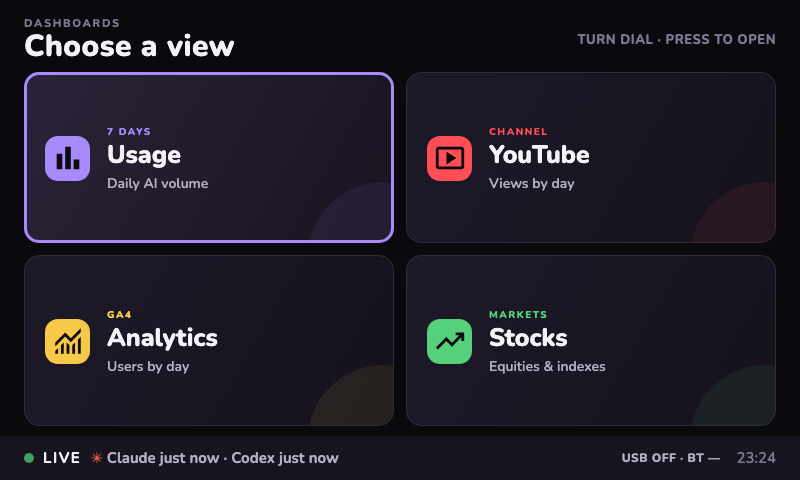 | 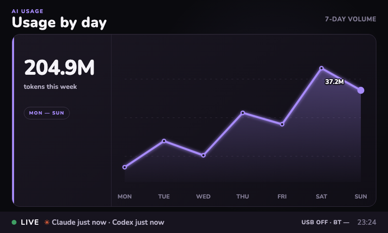 |

| Extensible provider overview | Rich provider detail |
| --- | --- |
| 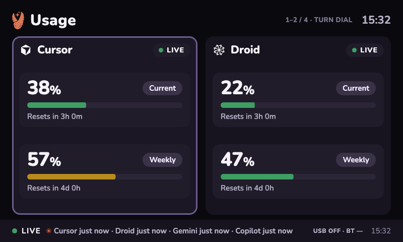 | 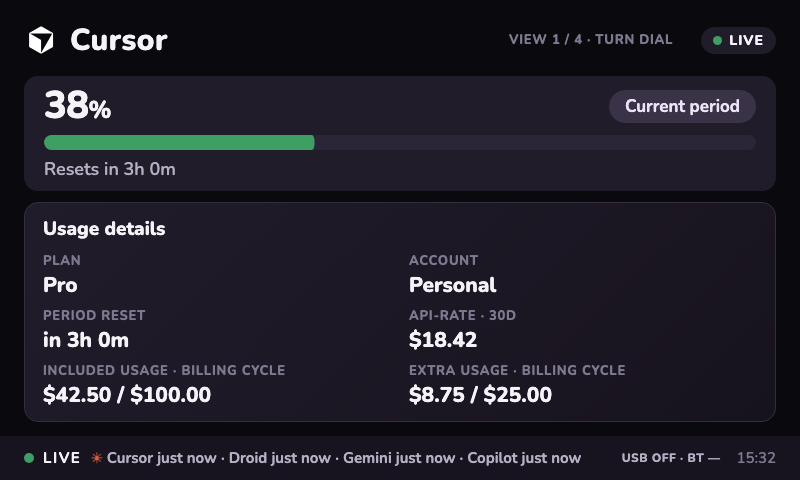 |

| YouTube channel analytics | Google Analytics 4 |
| --- | --- |
| 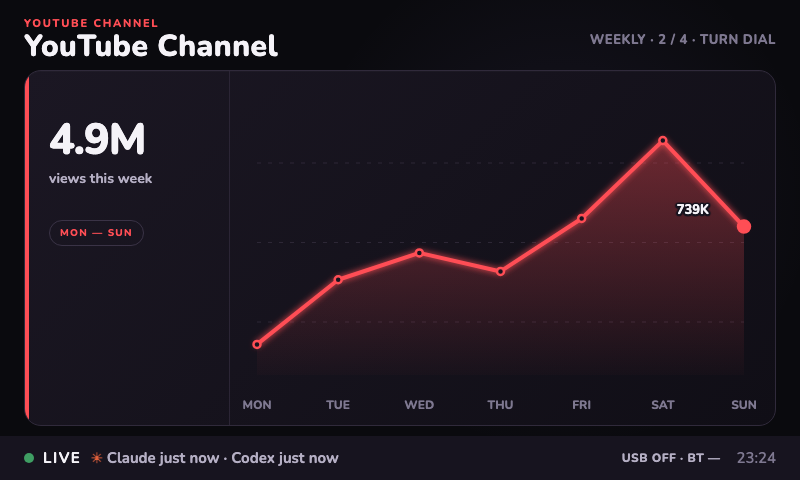 | 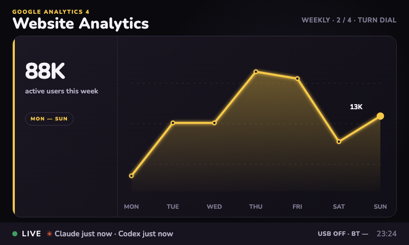 |

| Individual stock | Market index |
| --- | --- |
| 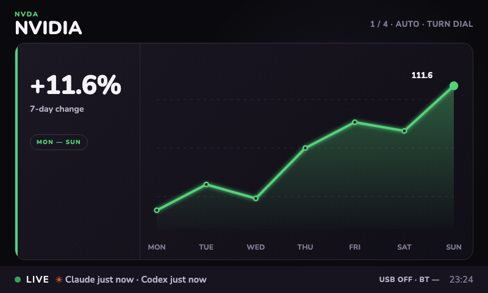 | 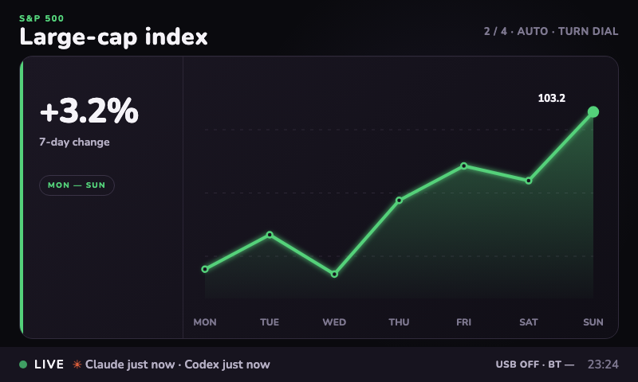 |

| Claude usage | Codex usage | System status |
| --- | --- | --- |
| 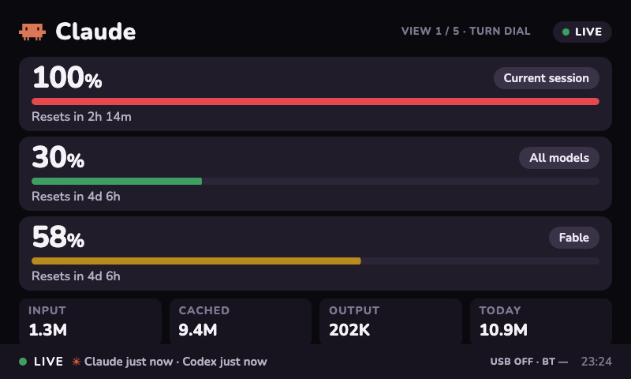 | 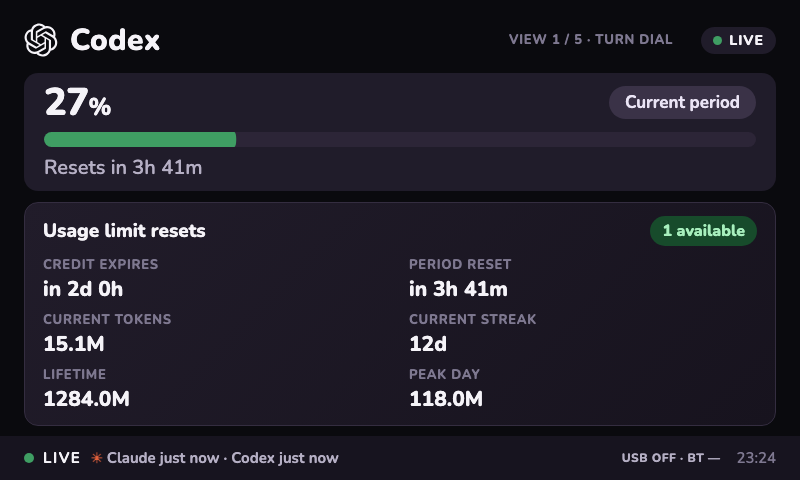 | 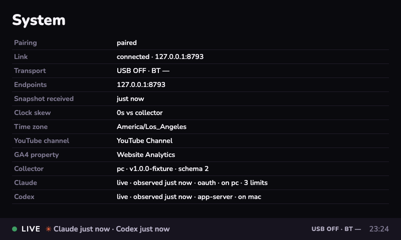 |

The rotary dial changes Daily, Weekly, Monthly, and Year ranges inside YouTube and GA4. Market views rotate automatically through the configured stocks, funds, and indexes; turning the dial switches immediately. The screenshots show the same dark 800×480 UI shipped in the device bundle.

## Ready to use today

- Claude quota windows from the local CLI login and status-line payloads, plus persisted last-valid state and local token summaries.
- Codex subscription windows, reset-credit availability, reset timing, and account usage facts from its local app server, plus detailed token classes from local rollout records.
- Self-updating account data: Codex account usage refreshes every minute (and on rate-limit notifications), Claude quota usage refreshes on a five-minute base cadence, and local Claude/Codex activity records are read every 15 seconds. The collector renews the Claude CLI's OAuth access token shortly before expiry without sending a model prompt; an interactive login is needed only if the underlying refresh grant is revoked or expires. The display reads an atomically updated local mirror delivered over preferred USB or automatic macOS Bluetooth fallback, while stable network clients receive WebSocket updates; none of these paths requires a page reload.
- Native Cursor, Gemini, Droid, and Copilot collectors, enabled only when selected, with plan identity, every available quota bucket, extra usage/overage, balances, costs, and provider-specific history where the signed-in account exposes them.
- A [65-provider catalog](docs/PROVIDER_CATALOG.md), with a unique explanation for every source, plus a validated JSON bridge for provider APIs, CLIs, scripts, and agent-written integrations. Unknown providers can use the same bridge contract without a firmware rebuild.
- Honest live, stale, unavailable, error, and offline states; missing data never becomes a fabricated zero.
- Atomic USB snapshot mirroring with an encrypted, HMAC-authenticated macOS Bluetooth fallback, authenticated HTTP/WebSocket transport for direct connections, multi-host merge rules, an honestly aged device cache, and visible `USB ACTIVE` / `BT ACTIVE` transport state in the bottom rail.
- Touch, horizontal swipes, rotary dial, dial press, Back, presets, and a System screen.
- An original Yocto product layer with ClaudeThing identity, boot artwork, loopback HTTP service, browser readiness gate, and development/production image recipes.
- Host time-zone provisioning plus identity-guarded clock repair on USB reconnect, so the device clock and calendar buckets follow the attached computer, including daylight-saving changes.
- A dashboard gallery with a seven-day AI usage chart, YouTube channel views, GA4 active users, and configurable individual/index/fund market charts. The dial switches Daily/Weekly/Monthly/Year within YouTube and GA4. Markets rotate automatically at the configured cadence; turning the dial changes the instrument immediately and restarts the timer.
- A hot-reloaded `dashboard-config.jsonc` controls provider order/visibility/data lanes, YouTube and GA4 display identifiers, market instruments, and rotation timing. Invalid edits retain the last valid configuration. The included analytics and market series demonstrate the views until authenticated host adapters provide live data; credentials remain off-device and out of this display config.

## How it works

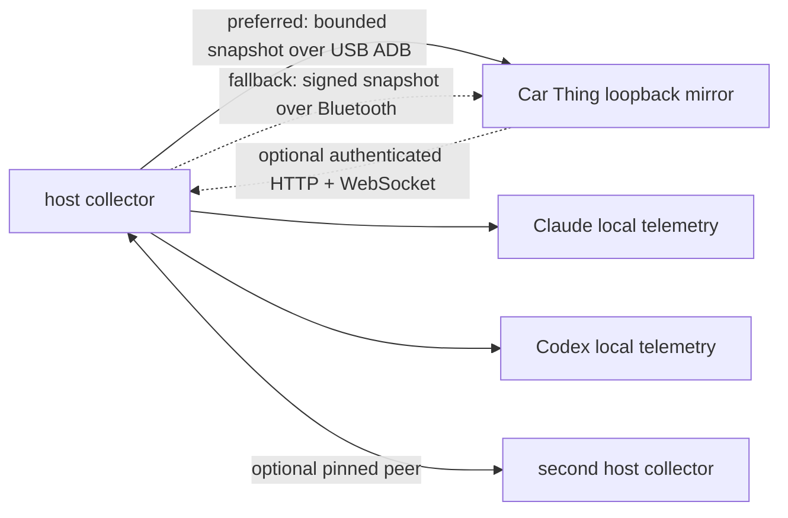

The device UI is served on `127.0.0.1:8080`; the collector is reached through `127.0.0.1:8790`. Pairing material is provisioned after flashing and is never built into a firmware artifact.

### Supported providers

Six popular providers have native collectors. Every other entry uses the same validated, owner-controlled JSON bridge, allowing a local integration to supply the supported display data while authentication remains on the host. Enable any combination by uncommenting its row in `dashboard-config.jsonc`.

<details>
<summary><strong>See all 65 providers and what ClaudeThing can display</strong></summary>

<!-- provider-catalog:start -->
| Provider | Connection | What it can show |
| --- | --- | --- |
| Codex (`codex`) | Native collector | Shows signed-in Codex limits, reset credits, token totals, and locally reconstructed usage history. |
| OpenAI (`openai`) | JSON bridge | Displays organization API usage, spend, budgets, and credit balances supplied by an owner-controlled integration. |
| Azure OpenAI (`azureopenai`) | JSON bridge | Monitors Azure-hosted model deployments, request activity, availability, and cost data from your Azure environment. |
| Claude (`claude`) | Native collector | Shows Claude current and weekly limits, reset timing, token totals, and local activity history when available. |
| Cursor (`cursor`) | Native collector | Tracks included requests, on-demand usage, plan identity, token activity, and recent Cursor cost history. |
| OpenCode (`opencode`) | JSON bridge | Presents workspace subscription consumption, remaining capacity, and reset timing from an OpenCode account integration. |
| OpenCode Go (`opencodego`) | JSON bridge | Surfaces OpenCode Go usage windows and locally observed quota data for the selected workspace. |
| Alibaba Coding Plan (`alibaba`) | JSON bridge | Displays Alibaba coding-plan allowances, consumed capacity, remaining quota, and upcoming resets. |
| Alibaba Token Plan (`alibabatokenplan`) | JSON bridge | Tracks Alibaba token-plan credits, token consumption, balances, and billing-period resets. |
| Qwen Cloud (`qwencloud`) | JSON bridge | Shows Qwen individual plan consumption across short rolling windows and longer weekly limits. |
| Gemini (`gemini`) | Native collector | Reads Gemini CLI authorization to display every model quota bucket and account tier the credential exposes. |
| Antigravity (`antigravity`) | JSON bridge | Presents locally collected Antigravity model allowances, remaining capacity, health, and refresh timing. |
| Droid (`droid`) | Native collector | Tracks Droid standard and core limits, extra-usage enablement, available balance, and organization plan identity. |
| Copilot (`copilot`) | Native collector | Shows GitHub Copilot chat, completion, and premium-request quotas with entitlements, overage, and reset timing. |
| Devin (`devin`) | JSON bridge | Displays Devin daily and weekly utilization, remaining allowance, reset timing, and account identity. |
| z.ai (`zai`) | JSON bridge | Tracks personal or team z.ai quotas, hourly and rolling windows, MCP activity, and remaining capacity. |
| Manus (`manus`) | JSON bridge | Shows Manus credit balance, monthly allocation, daily refresh credits, and consumption history. |
| MiniMax (`minimax`) | JSON bridge | Presents MiniMax coding-plan usage, remaining allowance, plan details, and renewal timing. |
| T3 Chat (`t3chat`) | JSON bridge | Separates T3 Chat base-plan consumption from paid overage so both usage pools remain visible. |
| ZoomMate (`zoommate`) | JSON bridge | Tracks ZoomMate credit consumption, remaining balance, plan identity, and historical usage. |
| Kimi (`kimi`) | JSON bridge | Shows Kimi weekly allowance alongside its shorter rolling rate limit and reset schedule. |
| Kilo (`kilo`) | JSON bridge | Displays Kilo Pass quota usage, credit availability, plan identity, and renewal information. |
| Kiro (`kiro`) | JSON bridge | Tracks Kiro monthly credits, bonus credits, consumed allowance, and billing-cycle reset timing. |
| Vertex AI (`vertexai`) | JSON bridge | Combines Google Cloud model activity with estimated token cost and project-level usage history. |
| Augment (`augment`) | JSON bridge | Shows Augment credit consumption, remaining capacity, plan information, and usage trends. |
| Amp (`amp`) | JSON bridge | Displays Amp plan usage, remaining free allowance, and the next quota refresh. |
| Ollama (`ollama`) | JSON bridge | Surfaces Ollama Cloud limits, consumed usage, available capacity, and account status. |
| Synthetic (`synthetic`) | JSON bridge | Tracks Synthetic rolling token quotas, weekly allowances, search limits, and their independent reset times. |
| JetBrains AI (`jetbrains`) | JSON bridge | Shows locally reported JetBrains AI monthly credits, usage, remaining balance, and renewal date. |
| Warp (`warp`) | JSON bridge | Displays Warp request limits, monthly credits, remaining capacity, and account plan information. |
| ElevenLabs (`elevenlabs`) | JSON bridge | Tracks ElevenLabs character allowance, consumed characters, remaining voice slots, and billing reset. |
| OpenRouter (`openrouter`) | JSON bridge | Shows OpenRouter credit balance, aggregate spend, request volume, and usage history across routed models. |
| Windsurf (`windsurf`) | JSON bridge | Presents Windsurf plan allowances, current consumption, remaining capacity, and renewal timing. |
| Zed (`zed`) | JSON bridge | Tracks Zed plan usage, edit-prediction quota, billing cycle, credits, and account payment state. |
| Perplexity (`perplexity`) | JSON bridge | Displays Perplexity account credits, consumed allowance, remaining balance, and usage history. |
| Xiaomi MiMo (`mimo`) | JSON bridge | Shows Xiaomi MiMo account balance, token-plan utilization, available quota, and resets. |
| Doubao (`doubao`) | JSON bridge | Monitors Doubao and Volcengine Ark request capacity, validation status, and observed consumption. |
| Sakana AI (`sakana`) | JSON bridge | Displays Sakana AI short-window and weekly quota consumption with independent reset timing. |
| Abacus AI (`abacus`) | JSON bridge | Tracks Abacus AI compute credits across ChatLLM or RouteLLM usage and remaining capacity. |
| Mistral (`mistral`) | JSON bridge | Shows Mistral API spend, available credits, monthly-plan utilization, and billing-cycle history. |
| DeepSeek (`deepseek`) | JSON bridge | Displays DeepSeek paid and promotional balances separately with aggregate remaining credit. |
| Fireworks (`fireworks`) | JSON bridge | Tracks Fireworks account spend over the recent billing period with project or account identity. |
| DeepInfra (`deepinfra`) | JSON bridge | Shows DeepInfra prepaid balance, current-month spend, configured spending limit, and remaining headroom. |
| Moonshot / Kimi API (`moonshot`) | JSON bridge | Displays Moonshot or Kimi API balance, consumed credit, and account-level usage history. |
| Venice (`venice`) | JSON bridge | Tracks Venice DIEM or dollar-denominated balances, consumption, and recent account activity. |
| Codebuff (`codebuff`) | JSON bridge | Shows Codebuff credit balance, weekly rate-limit utilization, remaining allowance, and resets. |
| Crof (`crof`) | JSON bridge | Displays Crof dollar credits with optional request-quota consumption and remaining capacity. |
| Command Code (`commandcode`) | JSON bridge | Tracks Command Code monthly dollar credits, used balance, remaining allowance, and renewal date. |
| Qoder (`qoder`) | JSON bridge | Shows Qoder large-model credits, consumed quota, remaining balance, and billing period. |
| StepFun (`stepfun`) | JSON bridge | Displays StepFun plan identity plus five-hour and weekly rate-limit usage and resets. |
| AWS Bedrock (`bedrock`) | JSON bridge | Presents AWS Bedrock spend, monthly budgets, remaining budget, and optional model activity metrics. |
| Grok (`grok`) | JSON bridge | Shows Grok plan or billing usage, account identity, remaining capacity, and refresh timing. |
| GroqCloud (`groq`) | JSON bridge | Tracks GroqCloud requests, tokens, cache efficiency, limits, and historical operational metrics. |
| LLM Proxy (`llmproxy`) | JSON bridge | Displays aggregate proxy quota and spend with optional per-provider request and token breakdowns. |
| ClawRouter (`clawrouter`) | JSON bridge | Shows ClawRouter monthly budget, spend, requests, tokens, and routed-provider distribution. |
| sub2api (`sub2api`) | JSON bridge | Tracks self-hosted gateway key quotas, subscription limits, wallet balance, and key-level usage. |
| Wayfinder (`wayfinder`) | JSON bridge | Monitors local routing health, route selection, savings, request volume, and decision latency. |
| LiteLLM (`litellm`) | JSON bridge | Shows LiteLLM personal and team budgets, current spend, remaining headroom, and proxy activity. |
| Deepgram (`deepgram`) | JSON bridge | Aggregates Deepgram speech, agent, token, and text-to-speech usage with cost or capacity metrics. |
| Poe (`poe`) | JSON bridge | Displays current Poe point balance, recent point consumption, and daily usage history. |
| Chutes (`chutes`) | JSON bridge | Tracks Chutes subscription, rolling and monthly quotas, pay-as-you-go usage, and reset schedules. |
| Neuralwatt (`neuralwatt`) | JSON bridge | Shows Neuralwatt subscription energy usage in kilowatt-hours alongside prepaid credit balance. |
| ZenMux (`zenmux`) | JSON bridge | Displays ZenMux five-hour and seven-day quotas plus pay-as-you-go balance and resets. |
| xAI (`xai`) | JSON bridge | Tracks xAI team prepaid credit, daily platform spend, remaining balance, and historical cost. |
| IBM Bob (`ibmbob`) | JSON bridge | Shows IBM Bob monthly Bobcoin budget and consumption across the selected subscription teams. |
<!-- provider-catalog:end -->

</details>

### Built to grow with you

Most personalization does not require a code change: edit the hot-reloaded `dashboard-config.jsonc` to choose what appears and how it rotates. Native collectors handle six popular tools. Any other API, CLI, script, or agent can write the documented, validated local JSON bridge contract—quotas, identity, health, cost, balances, scalar metrics, and daily charts—without rebuilding firmware. See [provider setup and authoring](docs/PROVIDERS.md).

In practice, that means a weather panel, build monitor, home-lab status view, calendar summary, or another usage provider can join the same experience without becoming a separate firmware project. Authentication stays on the host, and the device continues to receive only the display data it needs.

## Build it, test it, make it yours

Requires Node.js 20.19 or newer. Firmware builds additionally require Docker/Podman and `kas-container`.

```sh
npm install
npm run verify
npm run firmware:build
```

`npm run verify` type-checks the workspaces, runs unit and integration tests, builds the release, smoke-tests installation, proves authenticated browser behavior in both same-origin and real two-port firmware topology, and checks firmware source invariants. A build command never flashes a device.

Start with [INSTALL.md](INSTALL.md) for host installation, backup, firmware build, exact-artifact approval, provisioning, and hardware acceptance. Agents should read [AGENTS.md](AGENTS.md) and [HANDOFF.md](HANDOFF.md).

The installer creates the editable display file at `~/Library/Application Support/CarThingCollector/dashboard-config.jsonc` on macOS or `%LOCALAPPDATA%\CarThingCollector\dashboard-config.jsonc` on Windows. New installs begin with disabled stubs for the complete provider catalog; upgrades preserve the edited file and refresh a neighboring `dashboard-config.catalog.jsonc` reference copy. Common lanes cover quotas, identity, health, costs, reset credits, tokens, arbitrary bounded metrics, and daily metric history. The collector validates and applies saved changes within about five seconds without a service restart. Keep authentication tokens, cookies, and API keys out of this file; [provider setup](docs/PROVIDERS.md) shows the safe local alternatives.

## Where things live

- `apps/collector` — local adapters, merge engine, authenticated service, peer sync, and automatic USB/Bluetooth snapshot supervisors.
- `apps/device-ui` — Chrome-compatible React/Vite dashboard.
- `packages/contracts` — wire schema, validation, presentation helpers, and fixtures.
- `install` — guarded macOS/Windows host install and uninstall.
- `device` — device diagnosis, reversible qualification helpers, tunnel, and post-flash provisioning.
- `host/macos` — the independently authored native Bluetooth RFCOMM sender used by the collector fallback.
- `firmware` — ClaudeThing Yocto layer, artwork, build scripts, and firmware runbook.
- `tools` — packaging, installer smoke tests, screenshots, and browser proofs.

## Safety and limits

- Never flash without a complete off-device factory backup, a recovery path, and explicit approval naming the exact artifact, byte size, and SHA-256.
- Never use fastboot on this hardware. The repository deliberately provides no build-and-flash command.
- Consumer subscriptions do not provide billing-grade public usage APIs. Values come from local authenticated product telemetry and are not invoice-grade accounting.
- Daily YouTube channel analytics require authorization from the channel owner. GA4 reports likewise require an account or service account with access to the selected property. The current analytics and market modules are interface demonstrations; they do not claim a live external feed.
- Fresh telemetry requires USB, paired macOS Bluetooth, or another local network path. The signed Bluetooth envelope can also repair the battery-less display clock, but firmware recovery, initial provisioning, and device diagnosis still require USB. With no data path, the last validated snapshot remains visible and is labeled offline with its age.
- A boot logo proves early display/kernel progress, not application health. Run `device-tool.mjs doctor` and visually confirm dashboard pixels after every image change.

## License and independence

ClaudeThing-authored source, documentation, services, tests, and artwork are available under the [MIT License](LICENSE). This repository contains no copied dashboard source, patches, or firmware artifacts. Provider marks are included only as third-party compatibility identifiers and are not relicensed as MIT. See [docs/INDEPENDENT_IMPLEMENTATION.md](docs/INDEPENDENT_IMPLEMENTATION.md) and [THIRD_PARTY_NOTICES.md](THIRD_PARTY_NOTICES.md).

An assembled Linux image also contains its build system, kernel, browser, fonts, board support, and other packages under their own licenses. Those components are not relicensed as MIT; see [THIRD_PARTY_NOTICES.md](THIRD_PARTY_NOTICES.md) and the generated image license manifest.

ClaudeThing is a non-profit open-source project and is not affiliated with, endorsed by, sponsored by, or supported by Anthropic, OpenAI, Google, Spotify, or any other AI lab, model provider, platform vendor, or hardware manufacturer. Product names and provider marks are used only to identify compatible user-selected data sources; all trademarks belong to their respective owners.
